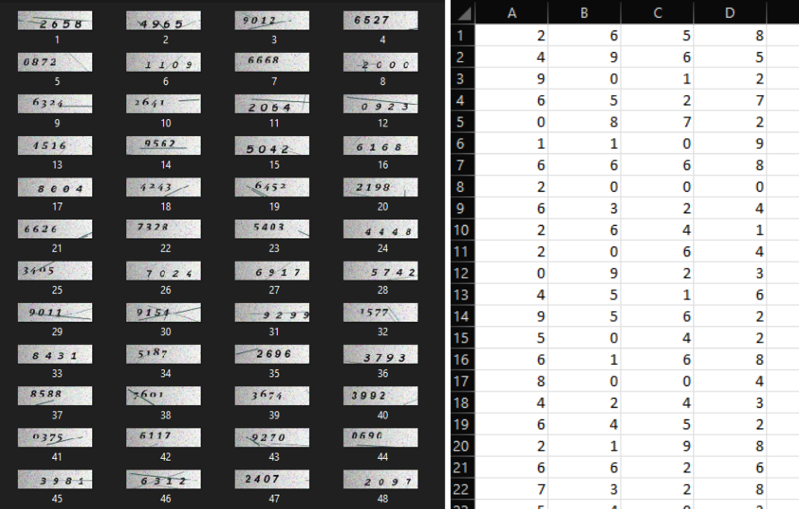
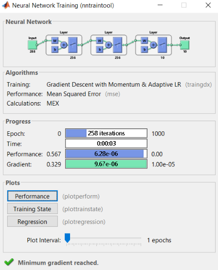
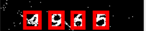

## Introduction to Image Processing and Computer Vision - Final Project: basic CAPTCHA recognition (Fall 2021)

This project focuses on demonstrating acquired knowledge from the course by implementation of the simple captcha solver on a small neural network. The solution is implemented in MATLAB using NN and CV packages.  

#### Image Generation

The small dataset with numbers and texts were specifically generated for solving this problem: *generatedigit.m* - digits & *generateletters.m* - letters. For generating the captcha images, eight different fonts were utilized: either letter or a digits is inserted into an image with a background gradient. Subsequently, the Gaussian and salt & pepper noise are applied, resulting in the obtained image. All resultant values are recorded for further accuracy analysis into the *targetvals* file.

#### Image Recognition Training & Test
The ANN is a feed forward simple neural network with 2 hidden layers of 256 neurons each, and training (for digits - *digitsANN.m* & for letters - *lettersANN.m*).
Training is performed with train images collected from the dataset: the training set is collected based on different fonts, collecting letters and digits of various fonts into single images. Using the CV package, the analysis of image is applied to find the objects with area more than 50pxs. Each of the objects is placed on the boundingbox and resized to 24x12 for convenience, and recorded into *TTraning*. The labelling pattern is chosen as a simple one-hot, as 1000000000 corresponding to zero, 0100000000 to one, and etc. As a result, there are:

- *TTarget* - the target values of samples
- *TTraining* - the training data formatted into 24x12 pixels for each sample
- *TPattern* - the samples (pattern) to be recognized

Testing: the images are loaded separately, cleaned from noise as much as possible, moved to BW, followed by finding the samples for recognition and placing them into TPattern, from which they will be further recognized.  

